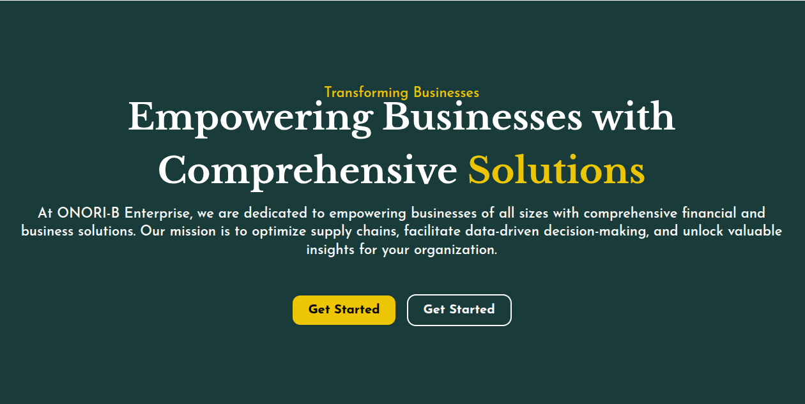
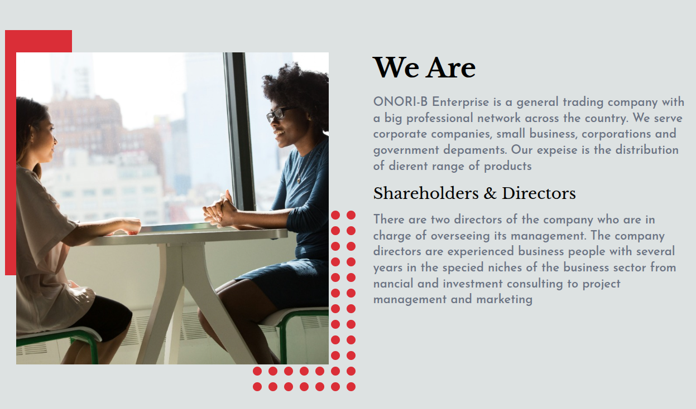
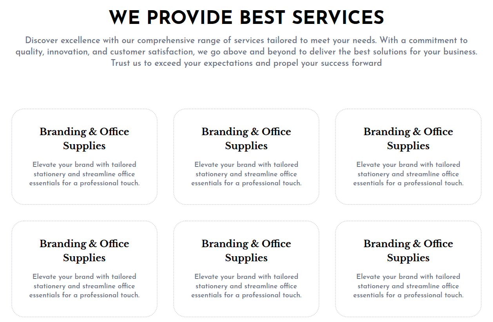
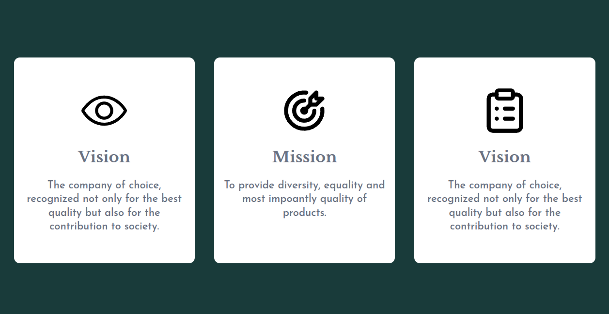
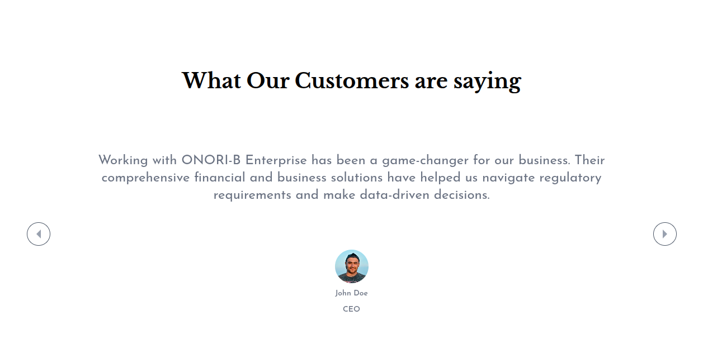
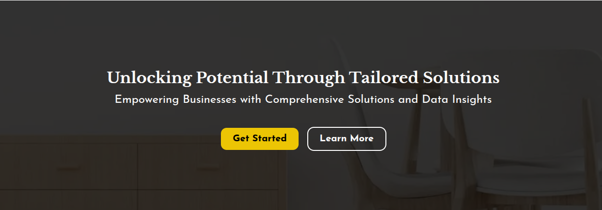
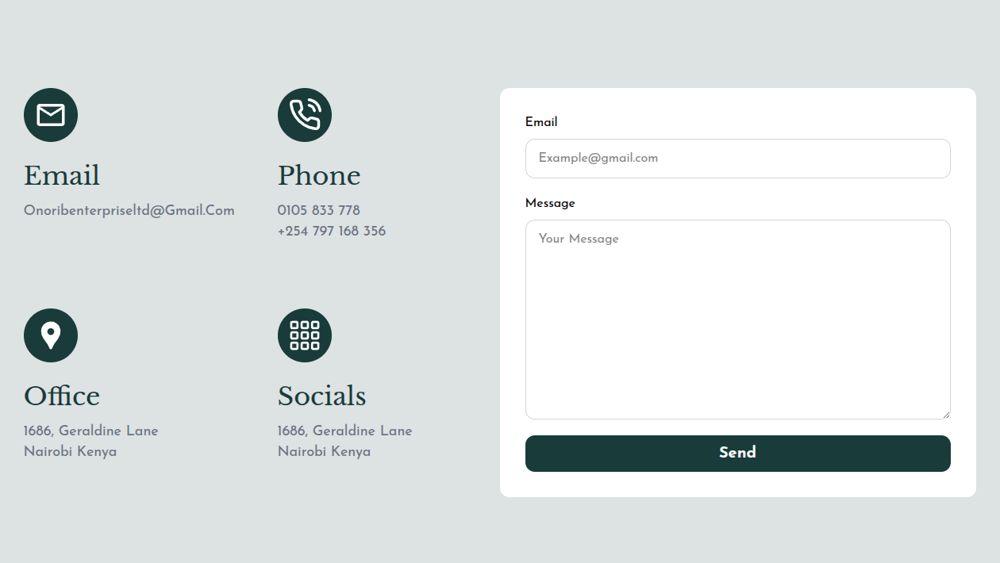

# Business Landing Page Exploration

A modern, high-performance, and fully responsive business landing page built to showcase corporate services, client testimonials, and interactive sections with smooth user experiences.

This project is meticulously crafted with a mobile-first approach, ensuring pixel-perfect responsiveness across all device sizes—from small smartphones to large desktop screens.

---

## Design Preview

Here are the design components and layout explorations for this landing page. 

<table>
  <tr>
    <td width="50%">
      
<b>Header Section</b>

      
    </td>
    <td width="50%">
      
<b>Hero Section</b>

      
    </td>
  </tr>
  <tr>
    <td>
      
<b>About Section</b>

      
    </td>
    <td>
      
<b>Services Section</b>

      
    </td>
  </tr>
  <tr>
    <td>
      
<b>Vision (Visi) Section</b>

      
    </td>
    <td>
      
<b>Testimonial Section</b>

      
    </td>
  </tr>
  <tr>
    <td>
      
<b>Call To Action (CTA)</b>

      
    </td>
    <td>
      
<b>Contact Section</b>

      
    </td>
  </tr>
  <tr>
    <td colspan="2">
      
<b>Footer Section</b>

      
    </td>
  </tr>
</table>

---

## Features & Interactive Elements

* **Fluid Motion & Animations:** The application is packed with high-quality, fluid, and modern animations powered by **Motion** (`motion/react`). Every transition, scroll effect, and element entry is designed to be smooth and micro-interactive.
* **Dynamic Testimonials:** The testimonial section features a responsive and interactive multi-device slider built using **Swiper.js**, allowing users to swipe through client feedback seamlessly.
* **Full Responsiveness:** Built utilizing Next.js 16 and Tailwind CSS v4 utility classes to deliver a fast, responsive UI for mobile, tablet, and desktop viewports.

---

## Tech Stack

* **Framework:** Next.js 16 (React 19)
* **Styling:** Tailwind CSS v4 (with PostCSS)
* **Animations:** Motion (`motion`)
* **Slider/Carousel:** Swiper
* **Icons:** React Icons
* **Utilities:** `clsx`, `tailwind-merge`, `class-variance-authority`
* **Compiler:** Babel Plugin React Compiler

---

## Getting Started

This project uses **pnpm** as its package manager. Follow these steps to run the development server locally:

### Clone the repository

git clone https://github.com/herihermansyah/bussiness-landing-page-exploration.git
cd bussiness-landing-page-exploration

## Install dependencies

Bash
pnpm install

## Run the development server

Bash
pnpm dev
Open http://localhost:3000 with your browser to see the result.

## Author
Name: Heri Hermansyah